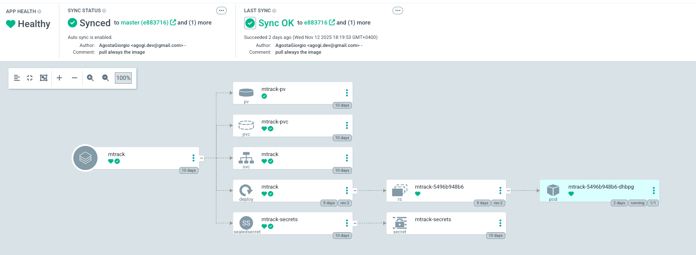

# MTrack 💰

A smart Telegram bot for tracking personal expenses with AI-powered transaction parsing from text or voice messages.

## 📖 Overview

MTrack is an intelligent expense tracking system that simplifies financial management through natural conversation. Simply send a text message or voice recording describing your expenses, and the bot will automatically parse and categorize your transactions. Get instant summaries, export reports, and keep your finances organized—all through Telegram.

## ✨ Key Features

- **💬 Text & Voice Input**: Record expenses via text messages or voice recordings in natural language
- **🤖 AI-Powered Parsing**: Leverages OpenAI's Whisper for voice transcription and LLM for intelligent transaction extraction
- **📊 Monthly & Annual Summaries**: Get detailed breakdowns of expenses by category and payment method
- **💳 Multi-Card Support**: Track expenses across different credit cards and payment accounts
- **🏷️ Smart Categorization**: Automatic categorization with primary and secondary categories
- **📤 Export & Import**: Export your data to CSV or generate comprehensive annual PDF reports
- **🔄 Transaction Management**: Modify existing transactions by replying to previous messages
- **⚡ Real-time Processing**: Asynchronous architecture for fast response times

## 🛠️ Technology Stack

### Core Framework
- **Python 3.10**: Modern Python with async/await support
- **python-telegram-bot**: Robust Telegram Bot API wrapper
- **SQLAlchemy**: ORM for database operations with async support
- **PostgreSQL (asyncpg)**: Reliable relational database for transaction storage

### AI & Machine Learning
- **OpenAI Whisper**: State-of-the-art speech recognition for voice transcription
- **PyTorch**: Deep learning framework (CPU-optimized build)
- **Custom LLM Integration**: For intelligent transaction parsing and categorization

### Data Processing & Export
- **Pandas**: Data manipulation and analysis
- **Matplotlib**: Chart generation for visual summaries
- **WeasyPrint**: PDF report generation
- **Jinja2**: HTML templating for beautiful reports

### Architecture & Infrastructure
- **Dependency Injector**: Clean dependency injection pattern
- **Pydantic**: Type-safe configuration and data validation
- **HTTPX**: Modern async HTTP client
- **Docker**: Containerized deployment

## 🚀 Getting Started

### Prerequisites

- Python 3.10 or higher
- PostgreSQL database
- Telegram Bot Token (from [@BotFather](https://t.me/botfather))
- FFmpeg (for audio processing)

### Installation

1. Clone the repository
```bash
git clone <repository-url>
cd MTrack
```

2. Install dependencies
```bash
pip install -r requirements.txt
```

3. Configure environment variables
```bash
cp .env.example .env
# Edit .env with your configuration
```

Required environment variables:
- `TELEGRAM_BOT_TOKEN`: Your Telegram bot token
- `TELEGRAM_CHAT_ID`: Your authorized chat ID
- `DATABASE_URL`: PostgreSQL connection string
- Additional LLM configuration as needed

4. Run the bot
```bash
python -m src.main
```

## 📱 Usage

### Adding Transactions

**Text Message:**
```
Spent 45.50 at grocery store with my Visa card
Coffee 5 euros this morning
```

**Voice Recording:**
Simply record a voice message describing your expenses in natural language.

### Commands

- `/start` - Initialize the bot and get welcome message
- `/ok` or `/save` - Save the transaction (reply to a transaction message)
- `/list` or `/config` - View configured cards and categories
- `/last [YYYY-MM]` - Get the last recorded transaction (optionally for specific month)
- `/summary [YYYY-MM]` - Get monthly expense summary (defaults to current month)
- `/annual [YYYY]` - Generate annual PDF report (defaults to current year)
- `/export [YYYY-MM]` - Export transactions to CSV (defaults to current month)

### Modifying Transactions

Reply to any transaction message with your modifications:
```
Change amount to 50
Update category to groceries
```

### Importing Data

Send a CSV file to the bot to bulk import transactions.

## 🏗️ Architecture

```
MTrack/
├── src/
│   ├── ai/               # AI components (Whisper, LLM)
│   ├── bot/              # Telegram bot logic
│   ├── config/           # Configuration and logging
│   ├── db/               # Database models and manager
│   ├── utils/            # Utilities (charts, export, import)
│   └── main.py           # Application entry point
├── requirements.txt      # Python dependencies
├── Dockerfile           # Container definition
└── export_template.html # Template for PDF reports
```

## ☸️ Kubernetes Deployment

This service can be deployed to Kubernetes using Helm. The complete Helm chart with all necessary configurations is available in the [HomeLab repository](https://github.com/AgostaGiorgio/HomeLab/tree/master/apps/mtrack).

### Deployment Resources

The Kubernetes deployment includes:
- **Deployment**: Main application container with resource limits
- **ConfigMap**: Environment configuration
- **Secret**: Sensitive credentials (bot tokens, database passwords)
- **Service**: Internal service exposure
- **PersistentVolumeClaim**: Storage for voice recordings and temporary files
- **Health Checks**: Liveness and readiness probes on port 9090

### ArgoCD Integration


*Screenshot showing all Kubernetes resources managed by ArgoCD*

The service is continuously deployed using ArgoCD, providing:
- Automated synchronization with Git repository
- Health monitoring of all resources
- Rollback capabilities
- GitOps workflow for infrastructure as code

## 🔒 Security Features

- **Chat ID Authorization**: Only authorized users can interact with the bot
- **Automatic Voice File Cleanup**: Temporary audio files are automatically deleted
- **Health Check Endpoint**: Exposed on port 9090 for monitoring
- **Graceful Shutdown**: Proper handling of SIGTERM and SIGINT signals

## 📊 Database Schema

The application uses PostgreSQL with the following main tables:
- `expenses`: Core transaction data
- `card_accounts`: Payment methods
- `categories`: Primary and secondary category mappings
- Transaction metadata (timestamps, amounts, reimbursements)

## 🤝 Contributing

Contributions are welcome! Please feel free to submit issues or pull requests.

## 📝 License

This project is licensed under the MIT License - see the [LICENSE](LICENSE) file for details.

## 🙏 Acknowledgments

- OpenAI for the Whisper model
- The python-telegram-bot community
- All open-source contributors

---
